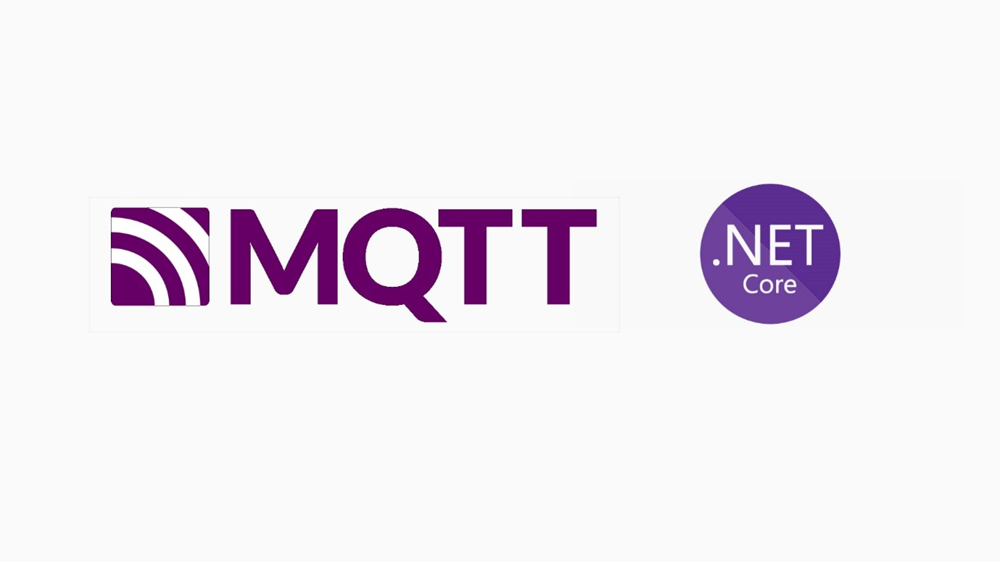

## MQTT .NET CORE Tutorial - ESP32 Firmware 

Projeto do firwmare para conexão do ESP32 ao broker MQTT Criado no curso de férias

**Como criar um servidor MQTT e conectar dispositivos IOT utilizando MQTT**

### Execução

Utilize o PlatformIO para execução do projeto.
